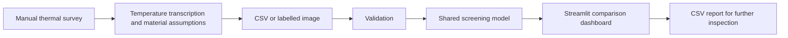

# Galbraith Building Thermal Analysis

A mobile thermal imaging workflow and interactive dashboard developed from an APS112 engineering design project at the University of Toronto. The project investigates how to identify, compare and communicate potential heat-loss zones around the Galbraith Building's first-floor main entrance.

**Status:** working educational screening prototype. The published application calculates a surface-temperature comparison proxy; it does not measure calibrated building heat flow or verified energy savings.

## The engineering problem

The University of Toronto Sustainability Office's living-lab project needed a repeatable way to locate and compare potential envelope heat-loss zones. Team 021 scoped the investigation to the accessible entrance, including glazing and metal door edges. The intended outcome was evidence to support further inspection and future retrofit prioritization.

The project combined client requirements, site measurements, concept generation and selection, a phone-attached thermal camera, spreadsheet analysis and a Python dashboard. The original project took place in January–April 2026; this repository was reorganized and its software corrected in September 2026.

## Run the application

Use Python 3.12. From the project directory:

```bash
python -m venv .venv
# Windows PowerShell
.venv\Scripts\Activate.ps1
# macOS / Linux instead: source .venv/bin/activate
python -m pip install -r requirements.txt
python -m streamlit run app.py
```

The app opens with three included historical observations, so no camera or private course files are needed. Select a zone, change its area or assumed U-value, click **Apply changes**, compare the updated results and download the complete CSV.

You can also upload a CSV matching [the example schema](data/example_observations.csv), or up to 20 images named `Zone(average maximum minimum materialID).jpg`. Image temperatures are transcribed in filenames, not extracted from pixels. The supported legacy IDs are 1 (single glazing), 2 (double glazing) and 3 (metal door edge); use CSV to supply other assembly labels and U-values.

## What is implemented

- Validated CSV and labelled-image input, with explicit reference temperature and basis.
- Editable material labels, U-value assumptions, areas, notes and inspection flags.
- One shared calculation and classification function for all results.
- Fixed screening bands, filtering, sorting, a comparison chart and detailed table.
- CSV export including all inputs, reference conditions and calculated outputs.
- Optional constant-condition energy extrapolation, disabled by default.
- Unit tests, Streamlit interaction tests and a GitHub Actions test workflow.

Persistent monitoring, automatic temperature extraction, automatic person blurring, registered floor-plan maps and measured retrofit savings are **not implemented**. They appear in the original concept or future-work discussion, not as completed product features.

## Architecture



```text
app.py                         Streamlit interface
thermal_analysis/model.py      Input validation, calculations, bands and export
data/example_observations.csv  Three consistent historical sample records
docs/                          Engineering process, architecture and evidence
tests/                         Numerical, ingestion and UI regression tests
scripts/package_release.py     Creates a clean upload ZIP from an explicit allowlist
.github/workflows/tests.yml    Automated test configuration
requirements.txt              Pinned direct dependencies
```

Original reports, correspondence, spreadsheets, videos and earlier programs remain in `_local_archive/` on the owner's computer. That directory is ignored by Git and excluded from the release ZIP.

## Demonstration results

With an indoor reference of 22.5°C and an assumed 1 m² per zone:

| Zone | Surface average | Assumed U-value | Screening indicator | Band |
|---|---:|---:|---:|---|
| Metal door edge | 10.9°C | 5.7 W/m²K | 66.12 W/m² | High |
| Glass door | 16.8°C | 5.7 W/m²K | 32.49 W/m² | Medium |
| Glass wall | 16.4°C | 2.8 W/m²K | 17.08 W/m² | Medium |

The metal door edge ranks highest under these assumptions. This is a screening result, not proof of the building's actual heat-loss distribution. The original wall record was excluded because its average exceeded its maximum and its material assignment varied between tables. No replacement temperature was invented.

The course presentation reported approximately 9.62% repeatability variation and 75% agreement with expected trends. The retained evidence does not provide a complete, unambiguous calculation trail to independently reproduce those headline metrics, so they are historical claims rather than validated performance specifications for this release.

## Engineering record

Read [the engineering process](docs/engineering-process.md) for the requirements, alternative concepts, selection, system integration, implementation and iterations. [The evidence matrix](docs/requirements-and-evidence.md) separates implemented behavior from targets and untested claims. [The debugging record](docs/verification.md) documents defects found and checks added during repository preparation.

The model is `indicator = assumed U × |surface temperature − reference temperature|`. Multiplying by area produces an area-scaled proxy. These surface/reference temperatures are not interchangeable with a validated indoor/outdoor assembly heat-transfer model. See [methodology and limitations](docs/methodology.md) and [data provenance](docs/data-provenance.md) before interpreting the outputs.

## Tests

```bash
python -m unittest discover -s tests -v
```

Core model tests use only the Python standard library. UI tests require `requirements.txt`. They check the example workflow, input changes, severity updates, filtering and export rather than claiming physical model accuracy.

## Team and contribution

Original APS112 Team 021: Nitya Patel, Yizuo (Jason) Wang, Zane Matuk, Ipsita Nandi and Deha Doganci. The client organization was the University of Toronto Sustainability Office. This repository is a student project and does not imply institutional endorsement.

Project records identify Jason as Research Coordinator, with documented work on site measurements, the service-environment analysis, progress reporting, presentation material and the web prototype. The design and final presentation were team efforts. See [credits](CREDITS.md) for the attribution boundary and disclosed AI assistance.

## Publication package

```bash
python scripts/package_release.py
```

This creates `dist/galbraith-thermal-analysis.zip`, containing only the public application, sample data, documentation and tests. Extract it and upload its contents to a fresh GitHub repository, or commit the organized working tree to the existing repository. Do not upload `_local_archive/`, `.venv/` or the outer `dist/` directory.

The existing local Git repository already has earlier commits and a GitHub remote. Ignoring files does not erase earlier commits. The clean ZIP contains no `.git` history; it is the simplest choice for publishing this curated version separately. No remote push or history rewrite is performed by the packaging script.

No blanket open-source license has been added: the original work is collaborative and includes course materials. Code visibility and permission to reuse are distinct; a license can be added once the contributors choose its terms.
